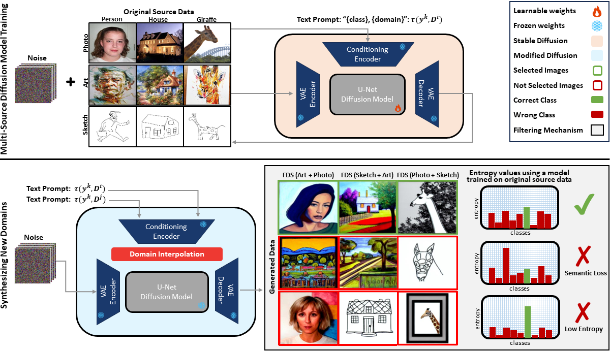

# FDS: Feedback-guided Domain Synthesis with Multi-Source Conditional Diffusion Models for Domain Generalization

The official implementation of our paper "Feedback-guided Domain Synthesis with Multi-Source Conditional Diffusion Models for Domain Generalization".


## Mehtod

<div style="text-align: center;">
    
</div>

<!-- Add space -->
<div style="margin-bottom: 15px;"></div>

* We introduce a novel DG approach that leverages diffusion models conditioned on different domains and classes to generate samples from novel, pseudo-target domains through domain interpolation. This approach increases the diversity and realism of the generated images;

* We propose an innovative strategy for selecting images that pose a challenge to a classifier trained on original images, ensuring the diversity of the final sample set. We then train a classifier on this enriched dataset, comprising both challenging generated images and original images, to enhance its generalization capabilities;

* We conduct extensive experiments across various benchmarks to validate the effectiveness of our method. These experiments demonstrate FDS's ability to significantly improve the robustness and generalization of models across a wide range of unseen domains, achieving state-of-art performance on these datasets. 


## Requirements
- [Python 3.8](https://www.python.org/)
- [CUDA 11.3](https://developer.nvidia.com/cuda-zone)
- [PyTorch 1.12.1](https://pytorch.org/)
- [PyTorch Lightning 1.5.0](https://lightning.ai/)
- [Numpy 1.23.1](https://numpy.org/)
- [timm 0.6.12](https://github.com/rwightman/pytorch-image-models)


## Usage

1- Clone the repository

2- Create an environment and Install the requirements
The `environment.yaml` file can be used to install the required dependencies:
```
conda env create -f environment.yml
```
3- Download one or all of the datasets

PACS, VLCS, and OfficeHome can be downloaded as follows:
```
python3 -m domainbed.scripts.download \
       --data_dir=./data --dataset pacs # or vlcs/officehome
```

4- Training diffusion models and synthesizing new domains

There are different bash files in `bash` directory which are prepared to reproduce the results of the paper for different datasets and domains.

As an example, here we show the codes for synthesizing new domains for `"art" "photo", "sketch"` domains of the PACS dataset (the corresponding domain indexes are "0" (art), "2" (photo), and "3" (sketch) and the target source will be "1" 'cartoon'):

Note that we use Stable Diffusion V1.5 as our inititialization weights, which can be downloaded from [this link](https://huggingface.co/runwayml/stable-diffusion-v1-5).


```
# train the diffusion model on the source domains of original PACS dataset
python train_dm.py -t --base configs/PACS/d023.yaml --gpus 0,1,2,3 --scale_lr False --no-test True --check_val_every_n_epoch 5 --logdir ./save/train_dm/PACS/d023 --init_weights init_weights/v1-5-pruned.ckpt

# synthesizing new domains using condition-level interpolation between "art" and "sketch"
ckpt_dir=/path/to/dffision/model/ckpt.pth
python interpolation.py --training_domains "art_painting" "photo" "sketch" --int_domains "art_painting" "sketch" --int_bounds 0.3 0.7 --scale_bounds 4.0 6.0 --outdir save/dm/PACS/d023/generation --H 256 --W 256 --n_samples 20 --iter_per_class 1600 --config configs/PACS/d023.yaml --ckpt ${ckpt_dir} --ddim_steps 50  --classes "dog" "guitar" "horse" "elephant" "house" "person" "giraffe"
```
Note that other interpolation methods proposed in tha paper can be found in the `DDIMSampler` class in the `ldm/diffison/ddim.py`.

5- Training/filtering the generated data

```
# train a classifier on the source domains of original PACS dataset
python train_cls.py PACS_023 --dataset PACS --deterministic --trial_seed 0 --data_dir ./data --work_dir ./save/train_cls/PACS/023 --test_envs 1

# evaluating the trained model on the newly generated data (new domains) and generate a csv file contains entropp values
ckpt_dir=path/to/a/trained/model.pth (from the previous step)
python eval_cls.py --data_dir save/dm/PACS/023/generation --save_dir save/eval/PACS/023/seed0 --ckpt_dir ${ckpt_dir}

# training the final classifier using both original and newly generated data
python train_cls.py PACS_seed0_d023 --dataset PACS --deterministic --trial_seed 0 --checkpoint_freq 100 --test_envs 1 --data_dir ./data --work_dir  --use_gen --gen_data_dir save/dm/PACS/023/generation --gen_csv_dir save/eval/PACS/023/seed0/image_predictions.csv --gen_num_per_class 570 --gen_only_correct


```

The commands to run other datasets/domains can be found in `bash` directory (only paths needed to be specified).

### Results

Here are the results of our prposed FDS method using two baslines `ERM` and `SWAD`. Refer to the paper for a more detailed exploration and comprehensive table of the results.

| **Method**          | **PACS**       | **VLCS**       | **OfficeHome** | **Avg.**  |
|---------------------|----------------|----------------|----------------|-----------|
| ERM (reproduced)    | 84.3 ±1.1      | 76.2 ±1.1      | 64.6 ±1.1      | 75.0      |
| ERM + FDS (ours)    | **88.8 ±0.1**  | **79.8 ±0.5**  | **71.1 ±0.1**  | **79.9**  |
| SWAD (reproduced)   | 88.1 ±0.4      | 78.9 ±0.5      | 70.3 ±0.4      | 79.1      |
| SWAD + FDS (ours)   | **90.5 ±0.3**  | **79.7 ±0.5**  | **73.5 ±0.4**  | **81.3**  |

### Visualizations

The following figure shows the interpolation between “art” and “sketch” in PACS highlights selected images (top rows + green boxes) merging textures and outlines, and non-selected images (bottom rows + red boxes) for failing selection criteria.

<div style="text-align: center;">
    
</div>

The following figure show the inter-domain transition from “sketch” to “art”. Displayed here is the transformation that occurs as \alpha is adjusted, beginning with 0.0 (pure sketches) and moving towards 1.0 (fully art-inspired images). The model effectively infuses basic sketches with complex textures and colors, transitioning from minimalistic line art to detailed
and vibrant artistic images.

<div style="text-align: center;">
    
</div>


## License

This source code is released under the MIT license, included [here](./LICENSE).

This project is bulit upon [ControlNet](https://github.com/lllyasviel/ControlNet) (Apache v2 licensed), [DomainBed](https://github.com/facebookresearch/DomainBed) (MIT licensed), and [SWAD](https://github.com/khanrc/swad) (MIT licensed). We thank the authors for releasing their codes.


